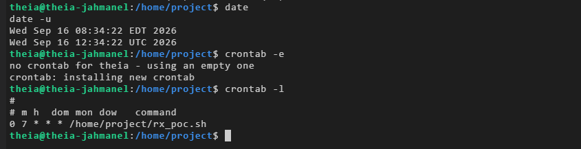
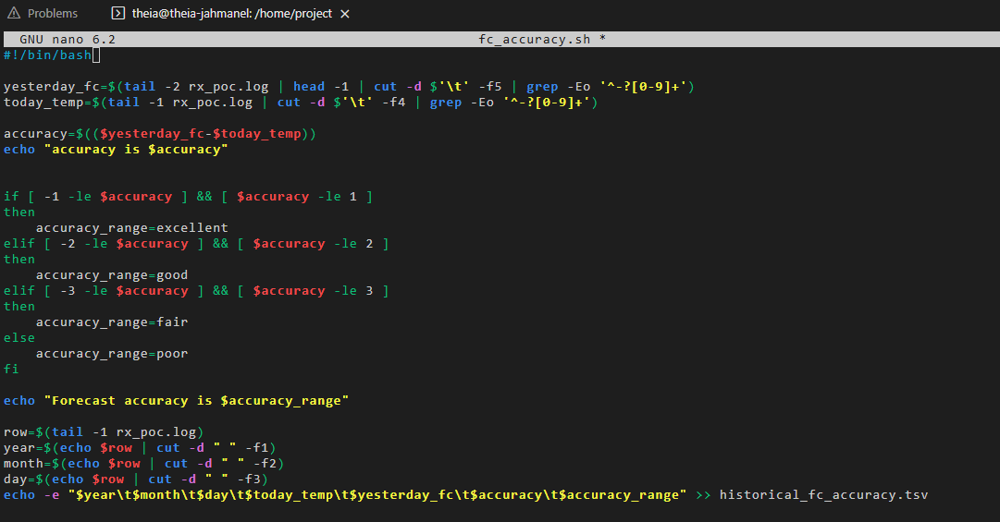
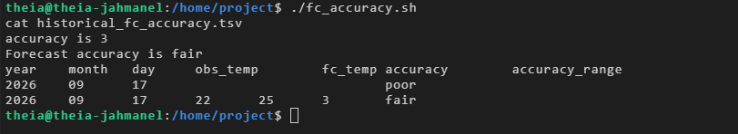
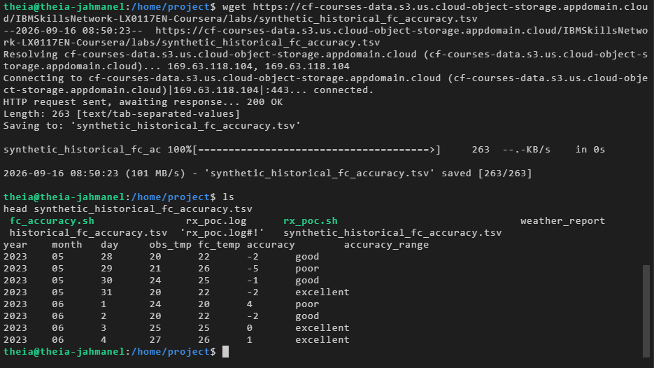
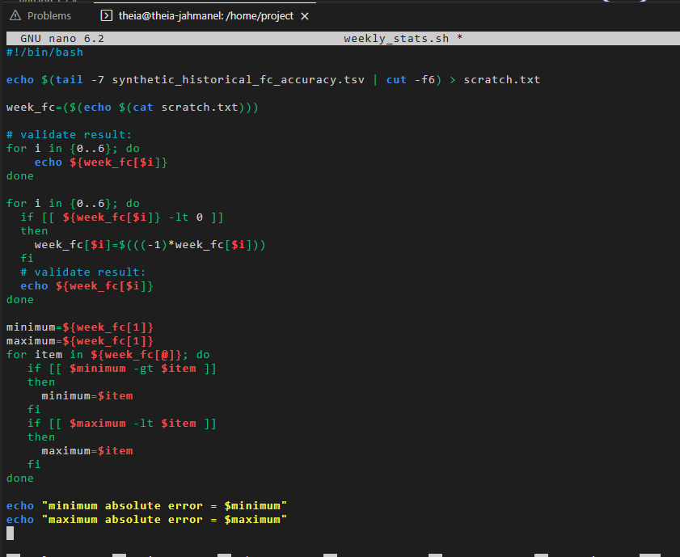
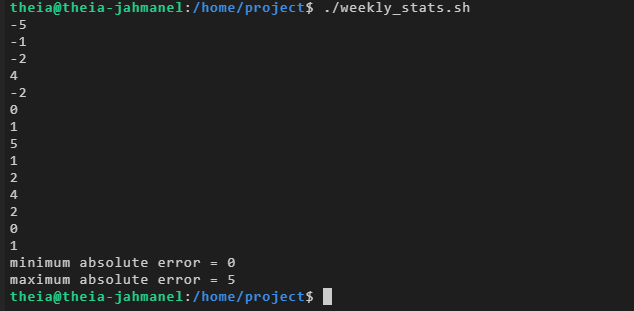

# Weather Data ETL & Forecast Accuracy Reporting (Bash)

A set of Bash scripts that pull live weather data, log it on a schedule via `cron`, and analyze forecast accuracy over time. Built as a hands-on project for IBM's DevOps/Software Engineering coursework, applying core Linux shell scripting concepts: process automation, data extraction with `cut`/`grep`, arrays, and conditional logic.

## What it does

1. **`rx_poc.sh`** — Pulls current and forecasted temperature data for a city from [wttr.in](https://wttr.in), extracts the relevant values with `grep`/`cut`, and appends a tab-delimited record to a running log file.
2. **Cron scheduling** — `rx_poc.sh` runs automatically once a day via `crontab`, so the log builds a real time-series of observed vs. forecasted temperatures without manual intervention.
3. **`fc_accuracy.sh`** — Compares yesterday's forecast against today's actual observed temperature, calculates the error, and labels it (excellent / good / fair / poor) based on how close the forecast was.
4. **`weekly_stats.sh`** — Loads a week of historical forecast accuracy data into a Bash array and reports the minimum and maximum absolute forecast error for the week.

## Skills demonstrated

- Scheduling recurring jobs with `cron` / `crontab`
- Parsing and transforming delimited text data (`cut`, `grep -Eo`, tab vs. space delimiters)
- Bash arrays and loops
- Conditional branching for data classification
- Building a small but complete ETL pipeline: **extract** (curl/wttr.in) → **transform** (parse temps, calculate accuracy) → **load** (append to log/report files)

## Example run

Cron job scheduled to run the weather script daily:



Weather log accumulating observed and forecasted temperature data:


`fc_accuracy.sh` — parses the log, calculates forecast error, and labels its accuracy:



Script output — computed accuracy and appended record:



Downloading the synthetic dataset used for weekly stats:



`weekly_stats.sh` — loads a week of data into an array and computes min/max error:



Final output — minimum and maximum absolute forecast error for the week:



## Files

```
scripts/
  rx_poc.sh              # Weather ETL script (run daily via cron)
  fc_accuracy.sh          # Forecast accuracy calculator
  weekly_stats.sh         # Weekly min/max error report
screenshots/              # Terminal output from a live run
```

## Notes

`rx_poc.sh` depends on `wttr.in` being reachable and generates `rx_poc.log`, which the other two scripts read from (or a synthetic dataset, in the case of `weekly_stats.sh`). These aren't included since they're generated/downloaded data, not source code.
